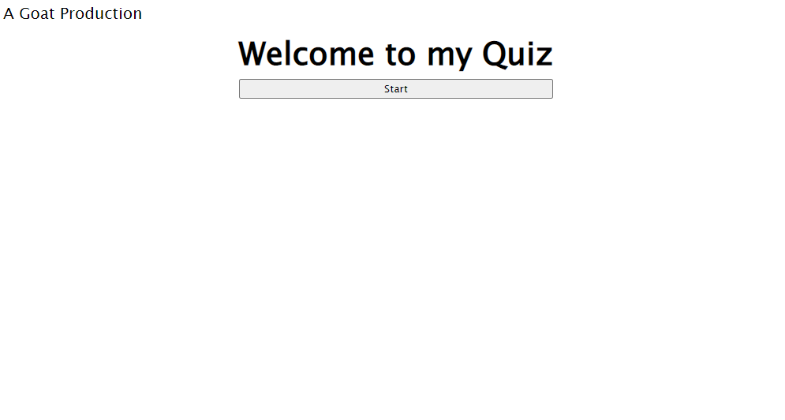
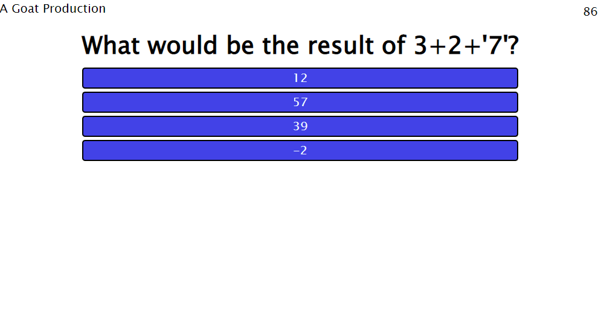

# Quiz Game

## Description
This project is meant to serve as a review tool for JavaScript to prepare for exams or interviews. The functional aspects of the quiz were done with JavaScript. As of now, the quiz only contains 3 questions; however more will be added in the future. I intend to create a separate JSON file in the future for easier question management. The JavaScript makes use of the Fisher-Yates algorithm to shuffle the questions so they can be presented in a random order.
The quiz also contains scoreboard functionality. The scoreboard takes a user's initials and score and adds it to a top 10 list.

The quiz can be accessed at the following URL: https://dbanfieldkeller.github.io/Quiz-Game/

The start page should appear as below:

When running the game should appear as below:
